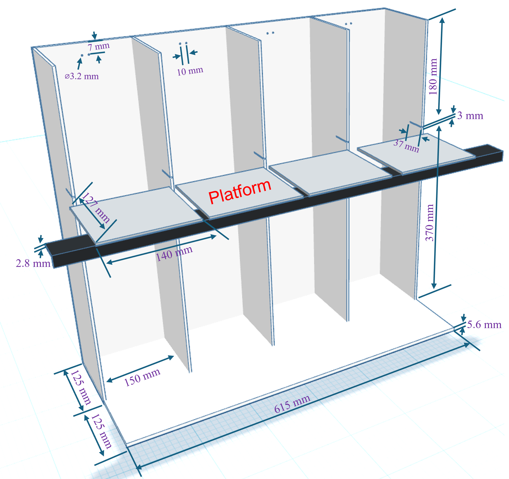

# iMOSS
This Immobility/Mobility Optimized Scoring System was originally developed for the Tail Suspension Test, but it can also be applied to other types of binary behavior scoring.

## TST box assemble:

## iMOSS-MV
This manual video scorer iMOSS-MV enables researchers to load video files, define regions of interest (ROIs), and mark behavioral events using intuitive keyboard shortcuts and a graphical interface. [details](Data_Analysis/zy_iMOSS_MV_instruction.docx).

### Python Envirement Installation:
  1. Install Anaconda
  2. Create a new Anaconda environment named "video_scorer" by importing the "[video_scorer.yaml](Data_Analysis/)" file. 
  3. Install Spyder 6.0.5 in this "video_scorer" environment
  4. Run "[zy_iMOSS_MV_20251119.py](Data_Analysis/)" inside Spyder.

### Scoring with iMOSS-MV (zy_iMOSS_MV_20251119.py):
  1. Load video file
  2. Draw ROI, and comforn the ROI with SPACE or ENTER key, then define Mouse_ID
  3. Use Buttons or keyboard shrcuts (detailed in "shortcuts" bottun) to navigate the video and mark the events.
  4. When finish annotating a ROI, click "Save Data" to save the ROI information (csv file) and immobility data (excel file)
  5. Optional:
     1. click "Save & Next Mouse" will also save the data and promp user to choose next ROI
     2. click "Draw ROI (r)" will also prompt user to save the data if exist.

  update: new version [zy_iMOSS_MV_withDuration](Data_Analysis/) will allow user to set the duration of session and adjust the size of video for other purposes.

## iMOSS-AS
The iMOSS-AS software and hardare package for scoring the TST with load-cell sensors.
### Python Envirement Installation:
  1. Install Anaconda
  2. Create a new Anaconda environment named "zy_NIDA_20240905" by importing the "[zy_NIDA_20240905.yaml](Data_Analysis/)" file.
  3. Install Spyder 6.0.5 in this "zy_NIDA_20240905" environment
  4. Run "[zy_iMOSS_AS_20251119_clean.py](Data_Analysis/)" inside Spyder.

Note: the python programs will require zy_importer_lite_V4.py and zy_preset_mpl_v2.py to be in the same folder.

This software is under a MIT license.
