# <b>iMOSS</b>: Immobility/Mobility Optimized Scoring System
<p align="center">
  
</p>   

<p align="center">
  <a href="https://www.frontiersin.org/journals/behavioral-neuroscience/articles/10.3389/fnbeh.2026.1819512/full">
    
  </a>
  
  
  
</p>

---

## 📌 Overview

**iMOSS** is an open-source platform for high-resolution immobility scoring in the tail suspension test (TST). By enabling precise synchronization with neural recordings, this platform supports critical advances in neuroscience and public health research.

### 🔑 Key Features
| Feature | Description |
|---|---|
| **iMOSS-MV** | Frame-accurate binary behavior manual scoring |
| **iMOSS-AS** | High-frequency automated scoring (80 Hz) |
| **Integration** | Seamless synchronization with neural recording systems |
| **Analysis** | Standardized and reproducible behavioral data processing |

---

## 🔄 Workflow

<p align="center">
  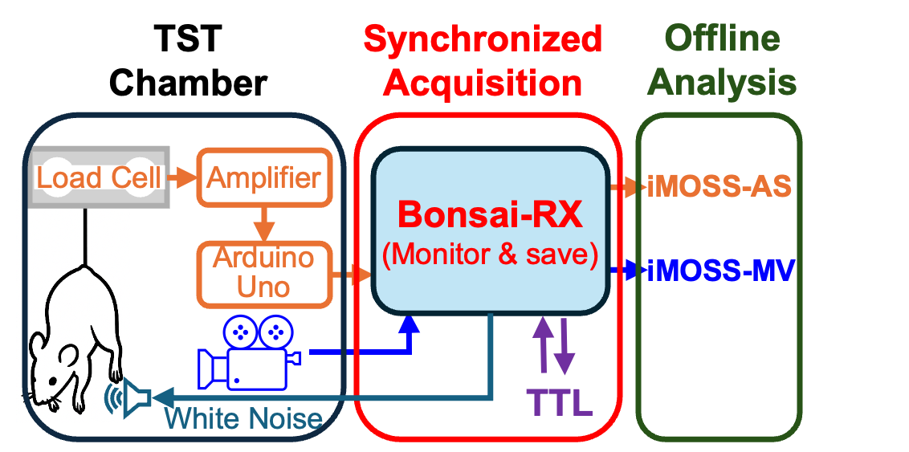
</p>

---

## 🧰 Materials

<p align="center">
  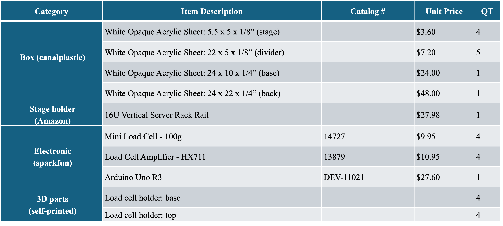
</p>

---

## 🏗️ TST Chamber Design

<p align="center">
	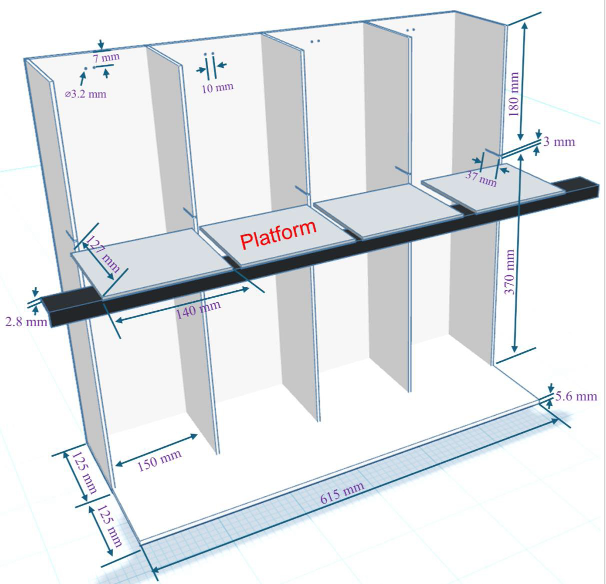
	 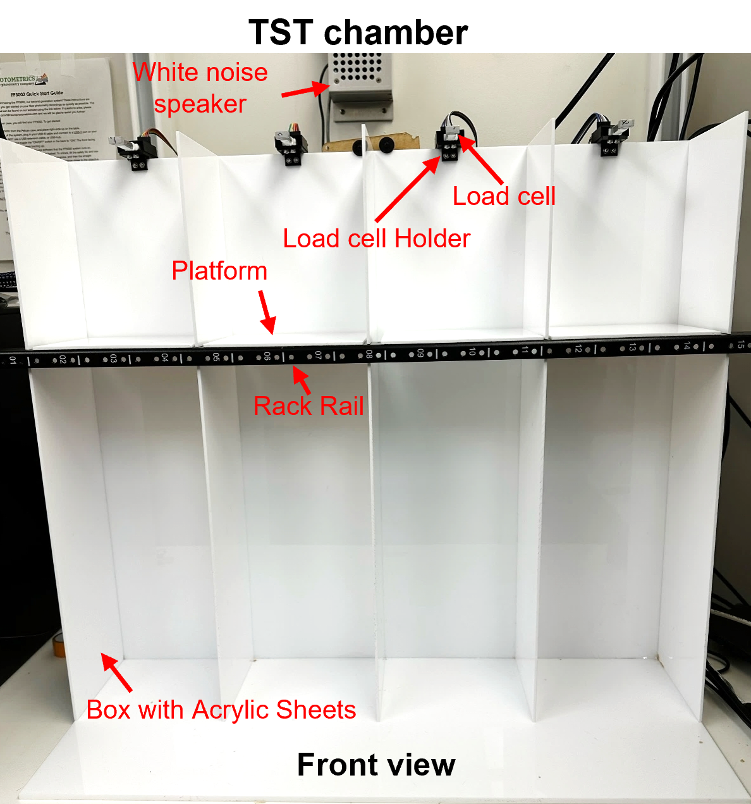
	 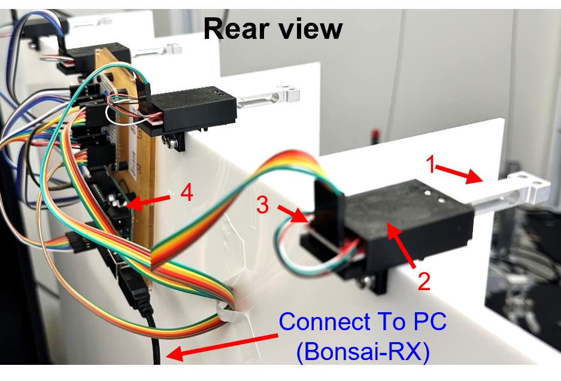
</p>

---

## ⚙️ iMOSS-AS Hardware Module

### 🔌 Design & Wiring

<p align="center">
  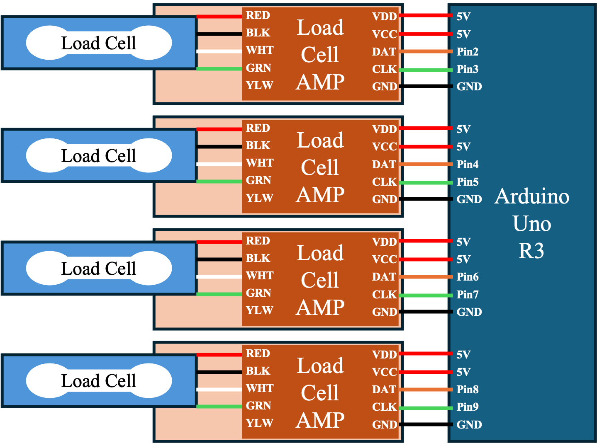
</p>

### ⚠️ Important Note

To achieve the **80 Hz sampling rate**, the load cell amplifier must be modified as shown below:

<p align="center">
  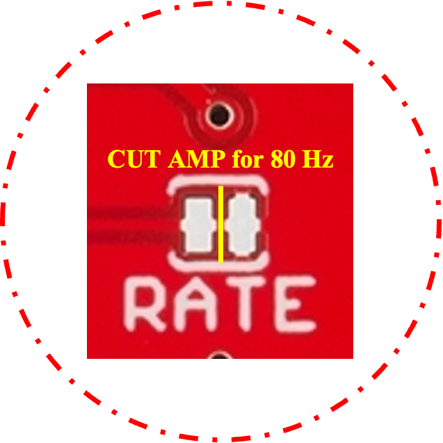
</p>

---

## 🔌 Firmware (Arduino Uno)

### 📥 Download
The firmware file is available here: `Firmware/iMOSS_AS_V1.ino`  
[Direct Link to Firmware Folder](https://github.com/addy9908/iMOSS/tree/main/Firmware)

### 🚀 Flashing Instructions
1. Install **Arduino IDE**.
2. Connect your **Arduino Uno**.
3. Open `iMOSS_AS_V1.ino`.
4. Click **Upload**.

<details>
<summary>Click for Arduino Code Preview</summary>

```cpp
//-------------------------------------------------------------------------------------
// iMOSS-AS for automatic tail suspension test with 4 load cells
//Author: Zengyou Ye at NIDA/IRP
//Date: 10/23/2024

// Settling time (number of samples) and data filtering can be adjusted in the config.h file of HX711_ADC.h
// HX711-ADC from: https://github.com/olkal/HX711_ADC
//---------------------------------

#include <HX711_ADC.h>

//pins:
const int HX711_dout_1 = 2; //mcu > HX711 no 1 dout pin
const int HX711_sck_1 = 3; //mcu > HX711 no 1 sck pin
const int HX711_dout_2 = 4; //mcu > HX711 no 2 dout pin
const int HX711_sck_2 = 5; //mcu > HX711 no 2 sck pin
const int HX711_dout_3 = 6; //mcu > HX711 no 3 dout pin
const int HX711_sck_3 = 7; //mcu > HX711 no 3 sck pin
const int HX711_dout_4 = 8; //mcu > HX711 no 4 dout pin
const int HX711_sck_4 = 9; //mcu > HX711 no 4 sck pin


//HX711 constructor (dout pin, sck pin)
HX711_ADC LoadCell_1(HX711_dout_1, HX711_sck_1); //HX711 1
HX711_ADC LoadCell_2(HX711_dout_2, HX711_sck_2); //HX711 2
HX711_ADC LoadCell_3(HX711_dout_3, HX711_sck_3); //HX711 3
HX711_ADC LoadCell_4(HX711_dout_4, HX711_sck_4); //HX711 4

unsigned long t = 0;
const int serialPrintInterval = 12.5; //80Hz to match 80SPS
static boolean togo = 0;


void setup() {
  Serial.begin(57600);
  delay(10);
  Serial.println();
  Serial.println("Starting...");


  float calibrationValue_1; // calibration value load cell 1
  float calibrationValue_2; // calibration value load cell 2
  float calibrationValue_3; // calibration value load cell 3
  float calibrationValue_4; // calibration value load cell 4


  calibrationValue_1 = 13.3; // uncomment this if you want to set this value in the sketch
  calibrationValue_2 = 13.3; // uncomment this if you want to set this value in the sketch
  calibrationValue_3 = 13.3; // uncomment this if you want to set this value in the sketch
  calibrationValue_4 = 13.3; // uncomment this if you want to set this value in the sketch

  LoadCell_1.begin();
  LoadCell_2.begin();
  LoadCell_3.begin();
  LoadCell_4.begin();

  unsigned long stabilizingtime = 2000; // tare preciscion can be improved by adding a few seconds of stabilizing time
  boolean _tare = true; //set this to false if you don't want tare to be performed in the next step
  byte loadcell_1_rdy = 0;
  byte loadcell_2_rdy = 0;
  byte loadcell_3_rdy = 0;
  byte loadcell_4_rdy = 0;


  while ((loadcell_1_rdy + loadcell_2_rdy + loadcell_3_rdy + loadcell_4_rdy) < 4) { //run startup, stabilization and tare, both modules simultaniously
    if (!loadcell_1_rdy) loadcell_1_rdy = LoadCell_1.startMultiple(stabilizingtime, _tare);
    if (!loadcell_2_rdy) loadcell_2_rdy = LoadCell_2.startMultiple(stabilizingtime, _tare);
    if (!loadcell_3_rdy) loadcell_3_rdy = LoadCell_3.startMultiple(stabilizingtime, _tare);
    if (!loadcell_4_rdy) loadcell_4_rdy = LoadCell_4.startMultiple(stabilizingtime, _tare);
  }
  if (LoadCell_1.getTareTimeoutFlag()) {
    Serial.println("Timeout, check MCU>HX711 no.1 wiring and pin designations");
  }
  if (LoadCell_2.getTareTimeoutFlag()) {
    Serial.println("Timeout, check MCU>HX711 no.2 wiring and pin designations");
  }
  if (LoadCell_3.getTareTimeoutFlag()) {
    Serial.println("Timeout, check MCU>HX711 no.3 wiring and pin designations");
  }
  if (LoadCell_4.getTareTimeoutFlag()) {
    Serial.println("Timeout, check MCU>HX711 no.4 wiring and pin designations");
  }
  LoadCell_1.setCalFactor(calibrationValue_1); // user set calibration value (float)
  LoadCell_2.setCalFactor(calibrationValue_2); // user set calibration value (float)
  LoadCell_3.setCalFactor(calibrationValue_3); // user set calibration value (float)
  LoadCell_4.setCalFactor(calibrationValue_4); // user set calibration value (float)
  Serial.print("HX711 measured sampling rate Hz: ");
  Serial.println(LoadCell_1.getSPS());
  Serial.println("Startup is complete");
}


void loop() {
  while (togo==0){
    char inByte = Serial.read();
    if (inByte == 'g') {
      togo=1;
      //Serial.println("ms,lc1,lc2,lc3,lc4");
      //Serial.println("experiments on");
    }
    if (inByte == 't') {
      LoadCell_1.tareNoDelay();
      LoadCell_2.tareNoDelay();
      LoadCell_3.tareNoDelay();
      LoadCell_4.tareNoDelay();
      delay(5000);
    }    
  }
  if(togo){
    LoadCell_1.update();
    LoadCell_2.update();
    LoadCell_3.update();
    LoadCell_4.update();

    if (millis() >= t + serialPrintInterval) {
      t = millis();
      float a = LoadCell_1.getData();
      float b = LoadCell_2.getData();
      float c = LoadCell_3.getData();
      float d = LoadCell_4.getData();
      
      Serial.print(t);
      Serial.print(",");
      Serial.print(a);
      Serial.print(",");
      Serial.print(b);
      Serial.print(",");
      Serial.print(c);
      Serial.print(",");
      Serial.println(d);
    }
  }
  if (Serial.read() == 'q') {
    togo=0;
  }
}
```
</details>

---

## 📡 Data Acquisition (Bonsai-RX)

### 📥 Workflow File
`Bonsai/ZY_tailSuspension_V11_Opstim.bonsai`
`Bonsai/ZY_TST_FP.bonsai`

### 💻 Workflow Layout and UI from V11
<p align="center"> 
	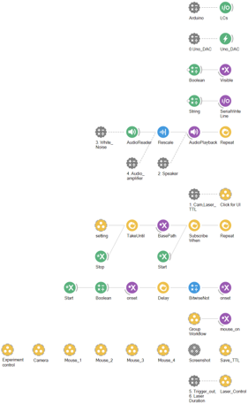
	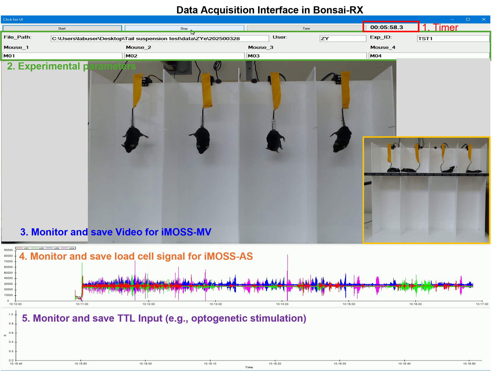
</p>

---

## 🧪 Data Analysis

### Python Envirement Installation:
  1. Install Anaconda
  2. Importing the listed "[yaml](Data_Analysis/)" environment file 
  3. Install Spyder in this environment
  4. Download Main script as well as Required script in the same folder
  4. Run Main Script inside Spyder.
---
### 🖥️ iMOSS-MV (Manual Scoring)
<p align="center">  </p>

#### 📦 Requirements
| Main Script | Conda Env | Link to Folder | Spyder Version |
|---|---|---|---|
| zy_iMOSS_MV_20251119.py | video_scorer.yaml | [iMOSS-MV V1](Data_analysis/iMOSS_MV/V1) | 6.05 |
| zy_iMOSS_MV_withDuration.py | video_scorer.yaml | [iMOSS-MV V2](Data_analysis/iMOSS_MV/V2) | 6.05 |
| zy_iMOSS_MV_20260501.py | iMOSS_MV_20260501.yml | [iMOSS-MV V3](Data_analysis/iMOSS_MV/V3) | 6.13 |

<p align="center"> iMOSS MV V1
	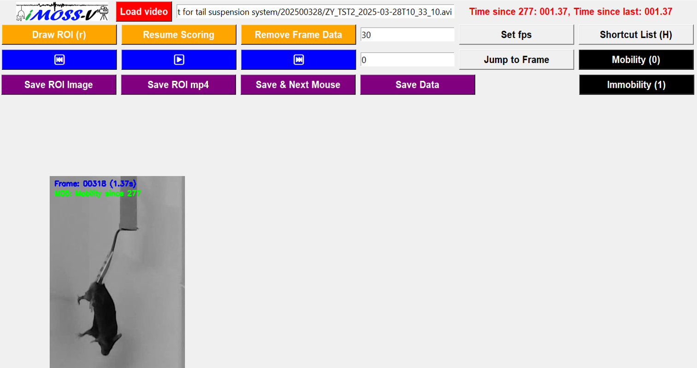
</p>
<p align="center"> iMOSS MV V3
	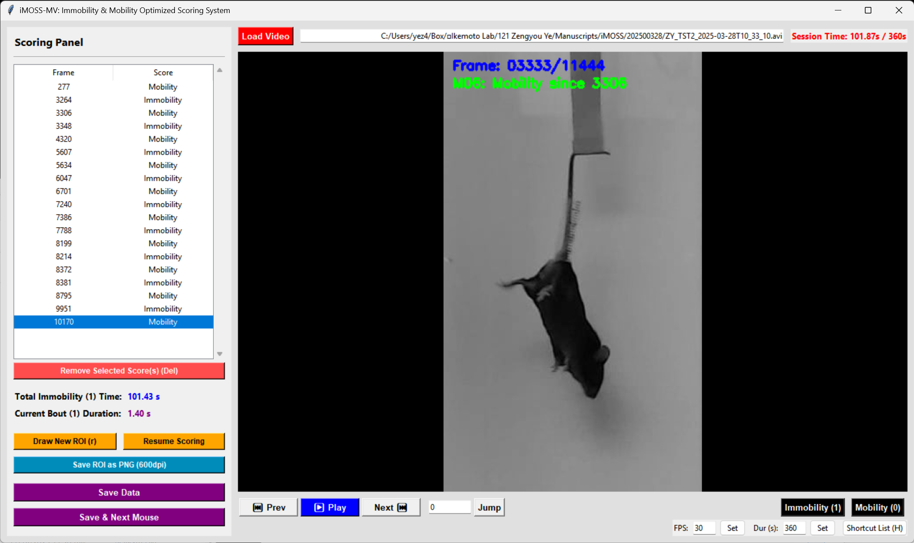
</p>

### Scoring with iMOSS-MV (zy_iMOSS_MV_20251119.py):
  1. Load video file
  2. Draw ROI, and comforn the ROI with SPACE or ENTER key, then define Mouse_ID
  3. Use Buttons or keyboard shrcuts (detailed in "shortcuts" bottun) to navigate the video and mark the events.
  4. When finish annotating a ROI, click "Save Data" to save the ROI information (csv file) and immobility data (excel file)
  5. Optional:
     1. click "Save & Next Mouse" will also save the data and promp user to choose next ROI
     2. click "Draw ROI (r)" will also prompt user to save the data if exist.

⚠️ update: 
* [**V2**](Data_Analysis/iMOSS_MV/V2): allow user to set the duration of session and adjust the size of video for other purposes.
* [**V3**](Data_Analysis/iMOSS_MV/V2): new design with better layout, and improve the Compatibility with new opencv  
---

### 🤖 iMOSS-AS (Automated Scoring)

<p align="center">  </p>

#### 📦 Requirements
| Main Script | Required Script | Conda Env | Folder | Spyder Version |
|---|---|---|---|---|
| zy_iMOSS_AS_20251119_clean.py| zy_importer_lite_V4.py; zy_preset_mpl_v2.py | zy_NIDA_20240905.yaml | [iMOSS-AS V1](Data_analysis/iMOSS_AS/Archive_V1) | 6.05 |
| zy_iMOSS_AS_20260501_with_summary.py | zy_importer_lite_V5.py; zy_preset_mpl_v2.py | iMOSS_AS.yml| [iMOSS-AS V2](Data_analysis/iMOSS_AS/V2) | 6.13 |


---

## 📄 Publication

For detailed scientific methodology, validation, and synchronization with Fiber Photometric recording, please refer to our paper:  
[Frontiers in Behavioral Neuroscience (2026)](https://www.frontiersin.org/journals/behavioral-neuroscience/articles/10.3389/fnbeh.2026.1819512/full)

---

## 📚 Citation

```bibtex
@article{iMOSS2026,
  title={iMOSS: an integrated open-source tail suspension test platform for high-resolution immobility scoring and synchronization with neural activity},
  journal={Frontiers in Behavioral Neuroscience},
  year={2026},
  doi={10.3389/fnbeh.2026.1819512}
}
```

---

## 🤝 Contributions

We welcome feedback and contributions from the community. If you find this platform helpful for your research, please ⭐ the repository.

## This iMOSS platform is under a MIT license.
